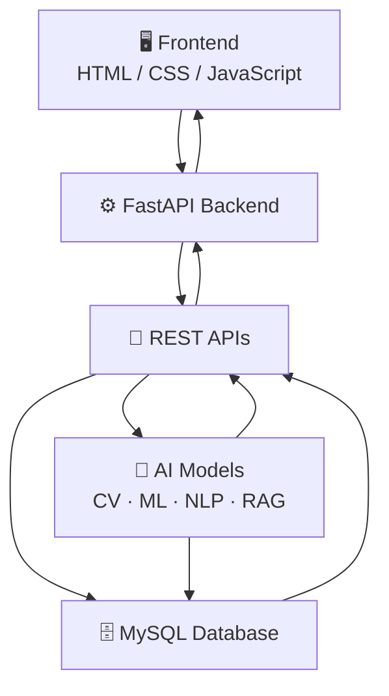
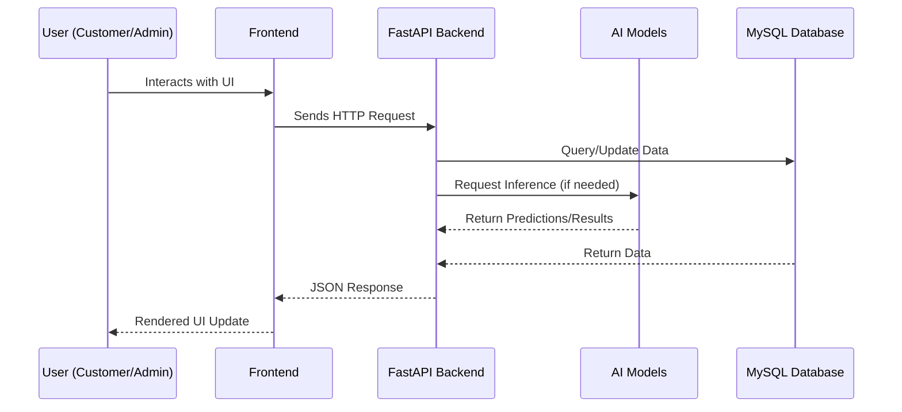
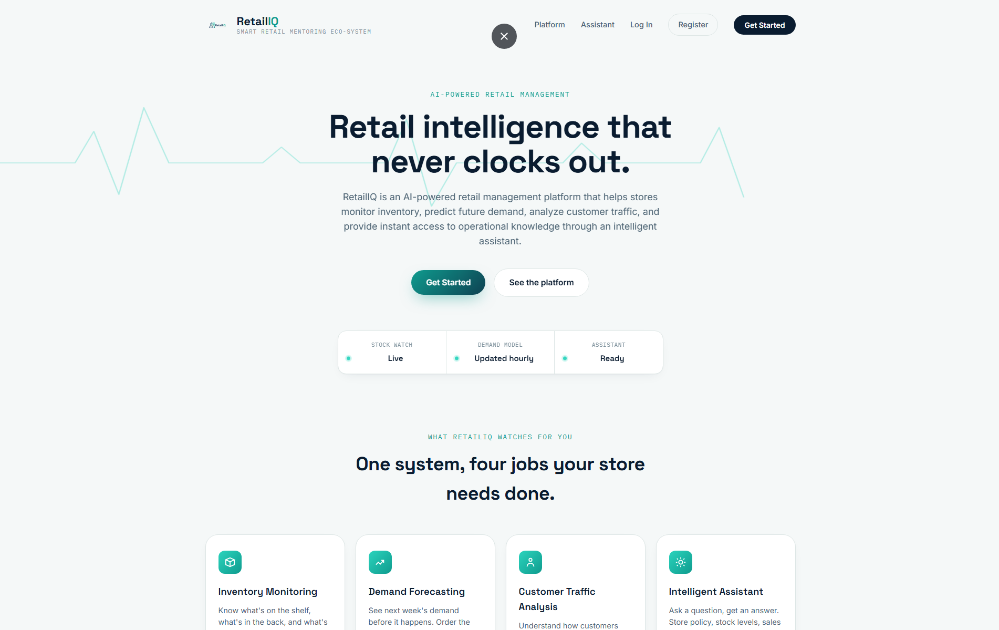
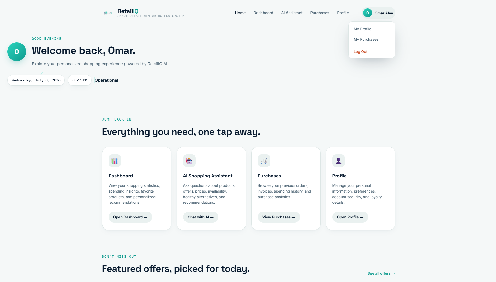
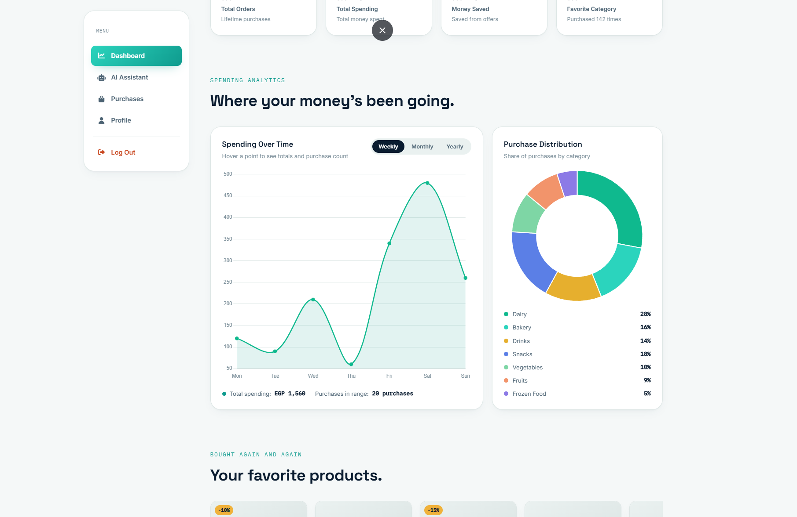

<div align="center">

# 🛍️ RetailIQ

### AI-Powered Smart Retail Monitoring Ecosystem

*Bringing Computer Vision, Machine Learning, NLP, and Business Intelligence together — in one intelligent retail platform.*

[](https://www.python.org/)
[](https://fastapi.tiangolo.com/)
[](https://github.com/ultralytics/ultralytics)
[](https://www.mysql.com/)
[](https://developer.mozilla.org/en-US/docs/Web/HTML)
[](https://developer.mozilla.org/en-US/docs/Web/CSS)
[](https://developer.mozilla.org/en-US/docs/Web/JavaScript)
[](#)
[](#)

[](#-license)
[](#)
[](#-contributors)

</div>

---

## 📚 Table of Contents

- [Project Overview](#-project-overview)
- [Features](#-features)
  - [Customer Features](#-customer-features)
  - [Administrator Features](#-administrator-features)
- [AI Modules](#-ai-modules)
- [System Architecture](#-system-architecture)
- [Tech Stack](#-tech-stack)
- [Project Structure](#-project-structure)
- [Database](#-database)
- [API Overview](#-api-overview)
- [Installation](#-installation)
- [Screenshots](#-screenshots)
- [Future Improvements](#-future-improvements)
- [Contributors](#-contributors)
- [License](#-license)
- [Acknowledgements](#-acknowledgements)
- [Contact](#-contact)

---

## 📖 Project Overview

**RetailIQ** is an AI-powered smart retail ecosystem that integrates **Computer Vision**, **Machine Learning**, **NLP**, **Retrieval-Augmented Generation (RAG)**, and **Business Intelligence** into a single unified platform.

The platform helps retail stores:

- 📦 Monitor inventory and shelf stock in real time
- 📊 Analyze sales, profit, and demand trends
- 🛒 Improve the customer shopping experience
- 🧠 Support data-driven decision making using AI

RetailIQ is built around **two primary user roles**:

| Role | Description |
|------|-------------|
| 🧑‍💻 **Customer** | Browses products, receives AI-driven recommendations, and interacts with an AI shopping assistant |
| 🧑‍💼 **Administrator** | Monitors store operations, inventory, sales, and generates AI-powered business intelligence reports |

---

## ✨ Features

### 🧑‍💻 Customer Features

- 🔐 **Authentication** — Secure sign-up / login system
- 🏠 **Customer Dashboard** — Centralized view of activity and recommendations
- 🤖 **AI Shopping Assistant (RAG)** — Conversational assistant for product/store queries
- 🔍 **Product Search** — Fast, filterable product discovery
- 🎯 **Personalized Recommendations** — AI-driven product suggestions
- 🧾 **Purchase History** — Complete record of past orders
- 📈 **Shopping Analytics** — Personal spending and shopping insights
- ⭐ **Loyalty Information** — Points, tiers, and loyalty rewards tracking
- 👤 **Profile Management** — Edit personal information and preferences

<details>
<summary><strong>💡 Customer Feature Details</strong></summary>

| Feature | Description |
|---|---|
| Authentication | JWT-based secure login/signup with session handling |
| Customer Dashboard | Unified summary of orders, offers, and recommendations |
| AI Shopping Assistant | RAG chatbot answering product/price/offer questions |
| Product Search | Keyword and category-based search with filters |
| Personalized Recommendations | ML-based suggestions from purchase behavior |
| Purchase History | Chronological list of all completed orders |
| Shopping Analytics | Visual breakdown of spending habits |
| Loyalty Information | Points balance, tier status, and reward eligibility |
| Profile Management | Update name, contact info, password, and preferences |

</details>

---

### 🧑‍💼 Administrator Features

- 🔐 **Authentication** — Secure admin login system
- 🏢 **Business Dashboard** — High-level overview of store performance
- 📦 **Inventory Monitoring** — Real-time stock level tracking
- 🎥 **Shelf Monitoring** — Computer vision-based shelf analysis
- 💰 **Sales Analytics** — Revenue and transaction trend analysis
- 📊 **Profit Analytics** — Margin and profitability insights
- 🔮 **Demand Forecasting** — Predict future product demand
- 📈 **Sales Forecasting** — Predict future sales volume
- 🧩 **Customer Segmentation** — Cluster customers by behavior
- ↩️ **Returned Order Prediction** — Predict likelihood of returns
- 💵 **Profit Prediction** — Forecast future profitability
- 📄 **AI Business Reports** — Automated AI-generated reports
- 📤 **Report Export** — Export reports in PDF format
- 🛠️ **Product Management** — Add, edit, and remove products
- 🗂️ **Category Management** — Organize products into categories
- 🎁 **Offer Management** — Create and manage promotional offers

<details>
<summary><strong>💡 Administrator Feature Details</strong></summary>

| Feature | Description |
|---|---|
| Authentication | Role-based secure admin access |
| Business Dashboard | Centralized KPIs: sales, profit, inventory, alerts |
| Inventory Monitoring | Live stock levels with low-stock alerts |
| Shelf Monitoring | YOLO-based detection of shelf occupancy and gaps |
| Sales Analytics | Revenue trends by time, category, and product |
| Profit Analytics | Profit margin breakdown across products |
| Demand Forecasting | ML forecasting of upcoming product demand |
| Sales Forecasting | Time-series prediction of future sales |
| Customer Segmentation | K-means/clustering of customer purchase patterns |
| Returned Order Prediction | Classification model predicting return risk |
| Profit Prediction | Regression model forecasting future profit |
| AI Business Reports | LLM-generated narrative business summaries |
| Report Export | One-click PDF export of dashboards/reports |
| Email Reports | Scheduled or on-demand report delivery via email |
| Product Management | Full CRUD for product catalog |
| Category Management | Full CRUD for product categories |
| Offer Management | Create, schedule, and manage discounts/promotions |

</details>

---

## 🧠 AI Modules

### 🎥 Shelf Monitoring
> Computer Vision model for product detection on retail shelves.

**Input:** Shelf image

**Output:**
- Detected products
- Product counts
- Empty shelf spaces
- Shelf occupancy percentage
- Histogram of detected products

---

### 🤖 AI Assistant
> RAG-based conversational chatbot for customer support.

**Capabilities:**
- Product information lookup
- Price inquiries
- Offers and promotions
- Category browsing
- Product recommendations
- General store information

---

## 🏗️ System Architecture



**Flow explanation:**

1. **Frontend** — Users (customers/admins) interact via a web interface built with HTML, CSS, and JavaScript.
2. **FastAPI Backend** — Handles routing, business logic, and authentication.
3. **REST APIs** — Expose endpoints consumed by the frontend and internal services.
4. **AI Models** — Computer vision, ML, and NLP models process data and return predictions/insights.
5. **MySQL Database** — Persists all structured data: users, products, orders, analytics, and reports.

### 🔄 Request Workflow



---

## 🧰 Tech Stack

<table>
<tr>
<td valign="top" width="50%">

**Frontend**
- HTML5
- CSS3
- JavaScript

**Backend**
- FastAPI
- Python

**Database**
- MySQL

**Computer Vision**
- YOLO

</td>
<td valign="top" width="50%">

**Machine Learning**
- Scikit-learn
- XGBoost
- Pandas
- NumPy

**Data Visualization**
- Chart.js

**NLP**
- LangChain
- FAISS
- Sentence Transformers
- HuggingFace Transformers

**Other**
- OpenCV
- Pillow
- Uvicorn

</td>
</tr>
</table>

---

## 📁 Project Structure

```
    RetailIQ/
    │
    ├── README.md                            # Project documentation
    ├── requirements.txt                     # Python dependencies
    ├── .gitignore
    ├── .env
    ├── .env.example
    ├── retailiq.db
    ├── run.py                               # Entry point for development
    │
    ├── app/                                 # FastAPI Application
    │   │
    │   ├── main.py                          # FastAPI app creation
    │   ├── config.py                        # Environment variables & configuration
    │   ├── dependencies.py                  # Shared FastAPI dependencies
    │   ├── database.py                      # Database connection/session
    │   │
    │   ├── routers/                         # API Routes
    │   │   ├── home.py                       # Homepage routes
    │   │   ├── auth.py                       # Login/Register/Admin authentication
    │   │   ├── customer.py                   # Customer dashboard APIs
    │   │   ├── admin.py                      # Admin dashboard APIs
    │   │   ├── assistant.py                  # RAG assistant APIs
    │   │   ├── shelf_monitoring.py           # Shelf monitoring APIs
    │   │   └── reports.py                    # Business report generation APIs
    │   │
    │   ├── services/                        # Business logic
    │   │   ├── __init__.py
    │   │   ├── auth_service.py               
    │   │   ├── customer_service.py          
    │   │   ├── admin_service.py             
    │   │   ├── dashboard_service.py         
    │   │   └── report_service.py            
    │   │
    │   ├── schemas/                         # Pydantic models
    │   │   ├── __init__.py
    │   │   ├── auth.py                      
    │   │   ├── customer.py                  
    │   │   ├── admin.py                     
    │   │   ├── assistant.py                 
    │   │   └── report.py                    
    │   │
    │   ├── models/                          # SQLAlchemy Models
    │   │   ├── __init__.py
    │   │   ├── user.py                      
    │   │   ├── customer.py                  
    │   │   ├── product.py                   
    │   │   ├── category.py                  
    │   │   ├── purchase.py                  
    │   │   ├── shelf.py                     
    │   │   └── inventory.py                 
    │   │
    │   ├── templates/                       # HTML Pages
    │   │   ├── home.html                          
    │   │   ├── login.html                   
    │   │   ├── register.html                
    │   │   ├── customer/       
    │   │   │   ├── main.html                
    │   │   │   ├── dashboard.html           
    │   │   │   └── assistant.html           
    │   │   │
    │   │   └── admin/
    │   │       ├── main.html                
    │   │       ├── dashboard.html           
    │   │       ├── shelf_monitoring.html    
    │   │       └── reports.html             
    │   │
    │   └── static/
    │       ├── css/
    │       ├── js/
    │       └── images/
    │   
    ├── ai_modules/
    │   │
    │   ├── shelf_monitoring/       
    │   │   ├── detector.py                  # YOLO inference
    │   │   ├── predictor.py
    │   │   ├── visualization.py             # Draw bounding boxes
    │   │   ├── metrics.py
    │   │   ├── config.py
    │   │   └── weights/
    │   │
    │   ├── rag_assistant/  
    │   │   ├── rag_pipeline.py              # Complete RAG pipeline
    │   │   ├── retriever.py
    │   │   ├── embeddings.py
    │   │   ├── vector_store.py
    │   │   ├── llm.py
    │   │   ├── prompt.py                   
    │   │   ├── chroma_db/          
    │   │   └── database_sync.py
    │   │
    │   ├── profit_prediction/   
    │   │   ├── predictor.py
    │   │   └── models/
    │   │
    │   └── report_generator/ 
    │       ├── report.py                    # Generate business report
    │       ├── llm_summary.py
    │       ├── pdf_generator.py
    │       └── templates/
    │
    ├── database/                            
    │   ├── seeds/
    │   ├── Migration_shelf_monitoring.sql
    │   └── schema.sql
    │
    ├── storage/
    │   ├── uploads/                     
    │   ├── reports/
    │   ├── detected_images/               
    │   └── logs/
    │
    ├── notebooks/
    │   ├── ShelfMonitoring.ipynb
    │   ├── ProfitPrediction.ipynb
    │   ├── ReportsGeneration.ipynb
    │   └── ReturnPrediction.ipynb

```

**Folder explanations:**

| Folder | Purpose |
|---|---|
| `backend/` | FastAPI application: routes, models, schemas, and business logic |
| `ai_modules/` | All AI/ML models — computer vision, forecasting, NLP, and report generation |
| `frontend/` | Static web interface for customers and administrators |
| `database/` | SQL schema and seed data for MySQL setup |
| `reports/` | Output directory for generated business reports |
| `docs/` | Extended documentation, diagrams, and design notes |
| `screenshots/` | Images used in this README |

---

## 🗄️ Database

| Table | Description |
|---|---|
| **Users** | Stores customer and admin account information and credentials |
| **Products** | Product catalog including name, price, description, and stock |
| **Categories** | Product category definitions and hierarchy |
| **Inventory** | Real-time stock levels linked to products and shelves |
| **Orders** | Customer order records with status and totals |
| **Order Items** | Line items linking orders to individual products |
| **Offers** | Active and scheduled promotional discounts |
| **Customer Analytics** | Aggregated behavioral and purchase data per customer |
| **Shelf Detection Results** | Output logs from the shelf monitoring CV model |
| **Reports** | Metadata and file references for generated business reports |

---

## 🔌 API Overview

| Group | Description |
|---|---|
| **Authentication** | Login, signup, token refresh, and session management |
| **Customer** | Product browsing, purchase history, recommendations, profile |
| **Admin** | Inventory, sales/profit analytics, product/category/offer management |
| **AI Assistant** | RAG-based chatbot query endpoint |
| **Shelf Monitoring** | Upload shelf images and retrieve detection results |
| **Reports** | Generate, export, and email business reports |

---

## ⚙️ Installation

```bash
# 1️⃣ Clone the repository
git clone https://github.com/Abdulrahman-Mahmoud-12/TransCare-AI.git
cd TransCare-AI

# 2️⃣ Create a virtual environment
python -m venv venv
source venv/bin/activate      # On Windows: venv\Scripts\activate

# 3️⃣ Install requirements
pip install -r requirements.txt

# 4️⃣ Create the database
mysql -u root -p -e "CREATE DATABASE retailiq;"

# 5️⃣ Run the schema
mysql -u root -p retailiq < database/schema.sql

# 6️⃣ Configure environment variables
cp backend/.env.example .env
# Edit .env with your DB credentials, secret keys, and API settings

# 7️⃣ Run the FastAPI server
python run.py

# 8️⃣ Open your browser
# Visit: http://localhost:8880
```

---

## 🖼️ Screenshots

<details>
<summary><strong>🏠 Home</strong></summary>

</details>

<details>
<summary><strong>🧑‍💻 Customer Main</strong></summary>

</details>

<details>
<summary><strong>📊 Customer Dashboard</strong></summary>

</details>

<details>
<summary><strong>🤖 AI Assistant</strong></summary>

`screenshots/ai_assistant.png`

</details>

<details>
<summary><strong>🧑‍💼 Admin Main</strong></summary>

`screenshots/admin_main.png`

</details>

<details>
<summary><strong>📈 Admin Dashboard</strong></summary>

`screenshots/admin_dashboard.png`

</details>

<details>
<summary><strong>🎥 Shelf Monitoring</strong></summary>

`screenshots/shelf_monitoring.png`

</details>

<details>
<summary><strong>📄 Business Reports</strong></summary>

`screenshots/business_reports.png`

</details>

---

## 🚀 Future Improvements

- 📱 Mobile Application
- 🎥 Real-time Camera Monitoring
- 🔲 Barcode Scanner Integration
- 🎙️ Voice Assistant Support
- 🏬 Multi-Store Management
- 🎯 Advanced Recommendation Engine
- 🔔 Live Notifications
- 🐳 Docker Deployment
- ☁️ Cloud Deployment
- 🔁 CI/CD Pipeline
- 🔐 Advanced Role Management

---

## 👥 Contributors

<table>
<tr>
<td align="center">
<a href="#">
<sub><b>Abdelrahman Mahmoud</b></sub>
</a><br/>
<sub>Team Leader | AI & ML Engineer</sub>
</td>
<td align="center">
<a href="#">
<sub><b>Saif allah Mohamed</b></sub>
</a><br/>
<sub>AI & ML Engineer</sub>
</td>
<td align="center">
<a href="#">
<sub><b>Aya Emad</b></sub>
</a><br/>
<sub>AI & ML Engineer</sub>
</td>
<td align="center">
<a href="#">
<sub><b>Sarah Mahrous</b></sub>
</a><br/>
<sub>AI & ML Engineer</sub>
</td>
<td align="center">
<a href="#">
<sub><b>Maryam Ashraf</b></sub>
</a><br/>
<sub>AI & ML Engineer</sub>
</td>
<td align="center">
<a href="#">
<sub><b>Shrouk Shaker</b></sub>
</a><br/>
<sub>AI & ML Engineer</sub>
</td>
</tr>
</table>

> Contributions are welcome! Feel free to open an issue or submit a pull request.

---

## 📜 License

This project is licensed under the **DEPI License**.

---

## 🙏 Acknowledgements

Special thanks to the open-source tools and libraries that made RetailIQ possible:

- [FastAPI](https://fastapi.tiangolo.com/)
- [YOLO (Ultralytics)](https://github.com/ultralytics/ultralytics)
- [OpenCV](https://opencv.org/)
- [LangChain](https://www.langchain.com/)
- [FAISS](https://github.com/facebookresearch/faiss)
- [HuggingFace Transformers](https://huggingface.co/)
- [Scikit-learn](https://scikit-learn.org/)
- [MySQL](https://www.mysql.com/)
- [Chart.js](https://www.chartjs.org/)

---

## 📬 Contact

<div align="center">

[](https://github.com/Abdulrahman-Mahmoud-12)
[](https://www.linkedin.com/in/abdulrahman-mahmoud-ai)
[](abdulrahmanmahmoudrezk@gmail.com)
[](https://abdelrahman-mahmoud-ai.vercel.app/)

</div>

---

<div align="center">

**⭐ If you find RetailIQ useful, consider giving it a star on GitHub! ⭐**

</div>